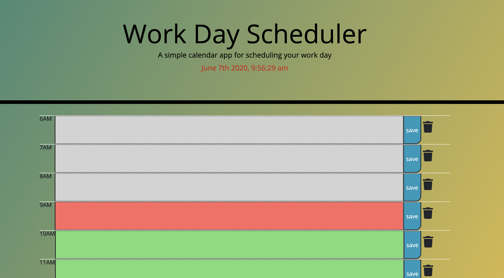

# 05 Third-Party APIs: Work Day Scheduler

To create a simple calendar application that allows the user to save events for each hour of the day (with HTML and CSS powered by jQuery) I need the following:

1. Use the [Moment.js](https://momentjs.com/) library to work with date and time. 
2. the current day is displayed at the top of the calendar
3. By scrolling down user is presented with timeblocks for standard business hours (I took from 6Am to 22PM).
4. Each timeblock is color coded to indicate whether it is in the past, present, or future
5. With ClickEvent user is able to enter an event into the timeblock
6. WHEN user clicks the save button for that timeblock
THEN the text for that event is saved in local storage
7. WHEN user refreshes the page, all saved events persist.
8. WHEN user clicks trash button, timeblock is empty with deleted event.

My application:

<!--  -->
